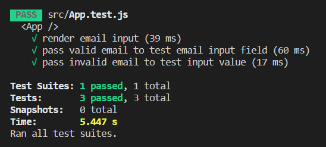

## Jest

자바스크립트 코드에 대한 테스트를 실행할 수 있도록 하는 test runner 입니다.

테스트를 찾아 실행하고 테스트가 통과하는지 검사합니다.

## Testing Library

컴포넌트 테스트를 한다는 점에서 jest와 차이점이 있습니다.

때문에 웹 브라우저 없이도 app을 렌더할 수 있고 UI가 올바르게 작동하는지 관찰할 수 있습니다.

<br />

## 설치 및 설정 방법

#### 설치

```
$ npm install -D @testing-library/jest-dom
$ npm install -D @testing-library/react
$ npm install -D @testing-library/user-event
```

#### 설정

1. 다음 테스트를 위해 끝난 테스트 삭제 작업

   ```
   import "@testing-library/react/cleanup-after-each";
   import "@testing-library/jest-dom/extend-expect";
   ```

2. matcher를 jest 테스트 러너에 인식시키는 작업

   ```
   import "@testing-library/jest-dom/vitest";
   import { cleanup } from "@testing-library/react";
   import { afterEach } from "vitest";

   afterEach(cleanup);
   ```

<br />

## 주요 API

| 함수      | 내용                                     |
| --------- | ---------------------------------------- |
| render    | 컴포넌트 렌더링 해주는 함수              |
| screen    | 특정 영역을 선택하기 위해 쿼리 함수 제공 |
| fireEvent | 특정 이벤트 발생                         |

```javascript
import { render, screen fireEvent } from "@testing-library/react";

render(<TestComponent />);

const button = screen.getByText(/click me/i);
fireEvent.click(button);
```

<br />

## 예제

```javascript
import React from "react";

function LoginForm({ onSubmit }) {
  const [email, setEmail] = React.useState("");
  const [password, setPassword] = React.useState("");

  return (
    <>
      <h2>Login</h2>
      <form onSubmit={() => onSubmit()}>
        <label>
          이메일
          <input
            type="email"
            placeholder="user@test.com"
            value={email}
            onChange={({ target: { value } }) => setEmail(value)}
          />
        </label>
        <label>
          비밀번호
          <input
            type="password"
            value={password}
            onChange={({ target: { value } }) => setPassword(value)}
          />
        </label>
        <button disabled={!email || !password}>로그인</button>
      </form>
    </>
  );
}
```

```javascript
import React from "react";
import { render, fireEvent } from "@testing-library/react";
import LoginForm from "./LoginForm";

describe("<LoginForm />", () => {
  it("submits form when button is clicked", () => {
    const obSubmit = jest.fn();
    render(<LoginForm onSubmit={obSubmit} />);

    const button = screen.getByRole("button", {
      name: /로그인/i,
    });
    expect(button).toBeDisabled();

    const email = screen.getByRole("textbox", {
      name: /이메일/i,
    });
    const password = screen.getByLabelText(/비밀번호/i);

    fireEvent.change(email, { target: { value: "user@test.com" } });
    fireEvent.change(password, { target: { value: "Test1234" } });

    expect(button).toBeEnabled();
    fireEvent.click(button);

    expect(obSubmit).toHaveBeenCalledTimes(1);
    expect(obSubmit).toHaveBeenCalledWith();
  });
});
```


